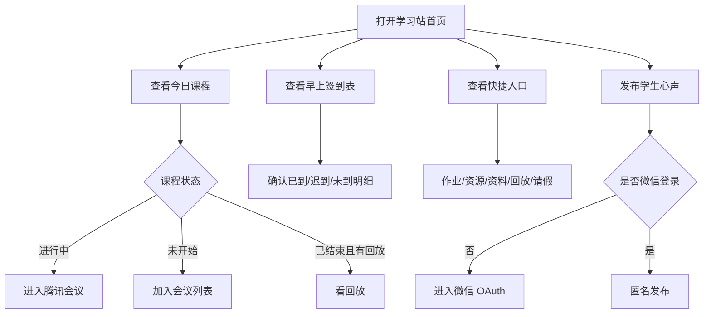
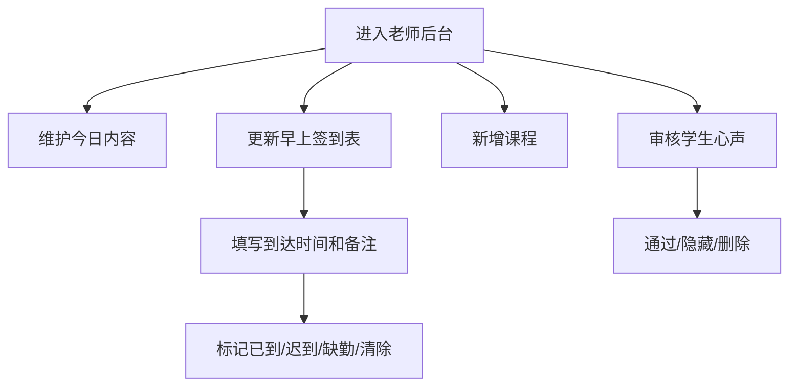

# 交互链路

## 学生端

```mermaid
flowchart TD
  A[打开学习站首页] --> B[查看今日课程]
  B --> C{课程状态}
  C -->|进行中| D[进入腾讯会议]
  C -->|未开始| E[加入会议列表]
  C -->|已结束且有回放| F[看回放]
  A --> G[查看早上签到表]
  G --> H[确认已到/迟到/未到明细]
  A --> I[查看快捷入口]
  I --> J[作业/资源/资料/回放/请假]
  A --> K[发布学生心声]
  K --> L{是否微信登录}
  L -->|否| M[进入微信 OAuth]
  L -->|是| N[匿名发布]
```

## 老师后台

```mermaid
flowchart TD
  A[进入老师后台] --> B[维护今日内容]
  A --> C[更新早上签到表]
  C --> D[填写到达时间和备注]
  D --> E[标记已到/迟到/缺勤/清除]
  A --> F[新增课程]
  A --> G[审核学生心声]
  G --> H[通过/隐藏/删除]
```

## 签到表链路

1. 老师选择日期。
2. 系统读取活跃学生名单和当天签到记录。
3. 老师逐个学生标记状态。
4. API 写入 `data/store.json`。
5. 学生端刷新后重新聚合签到汇总和迟到总结。
